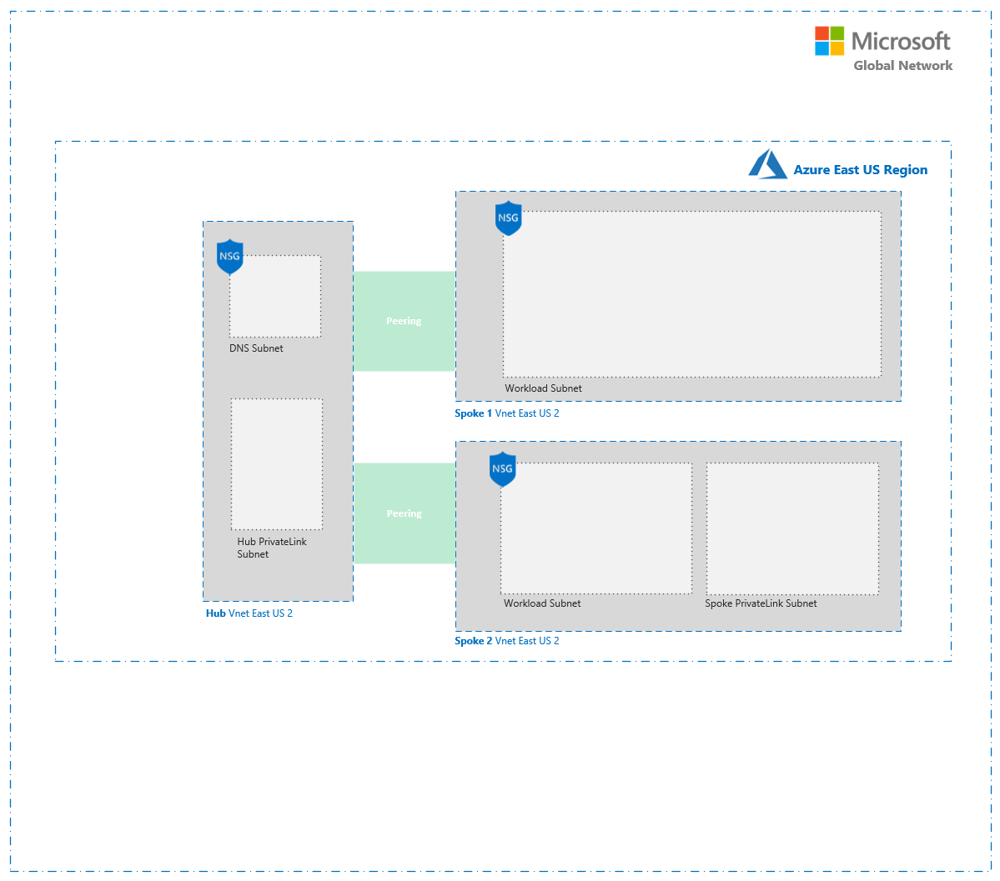
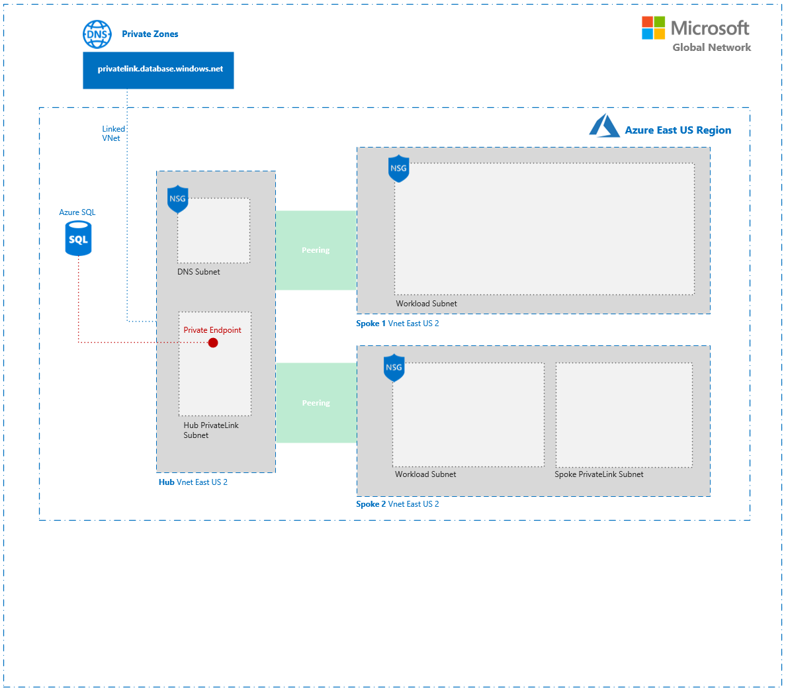
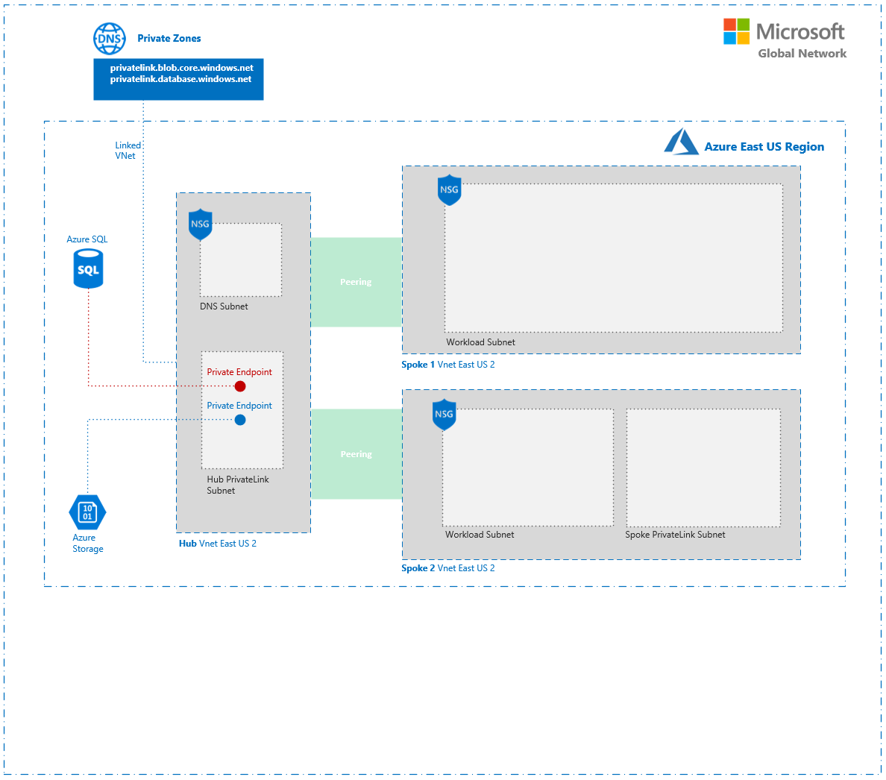
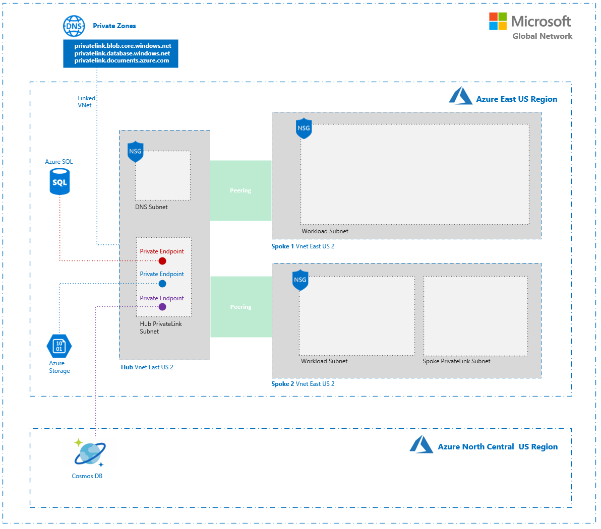
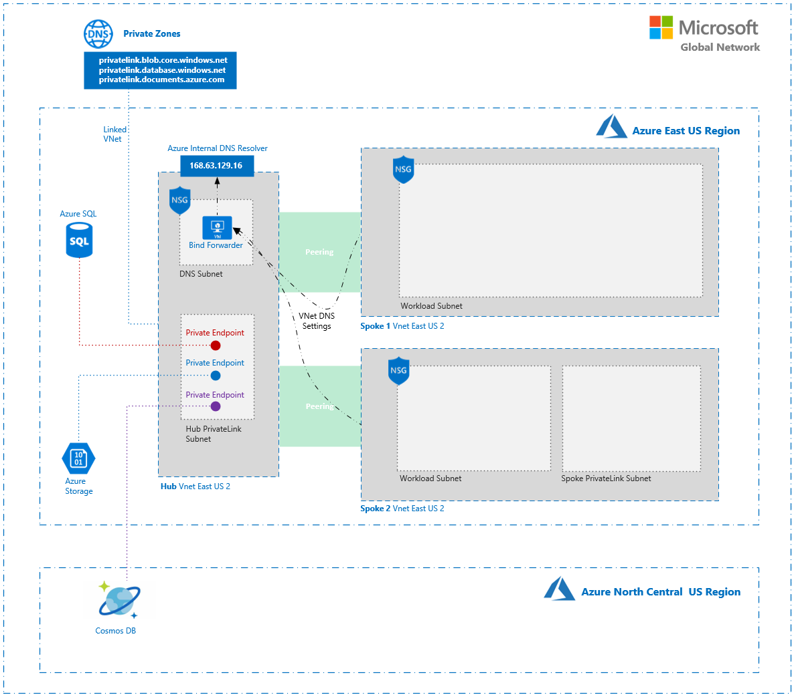
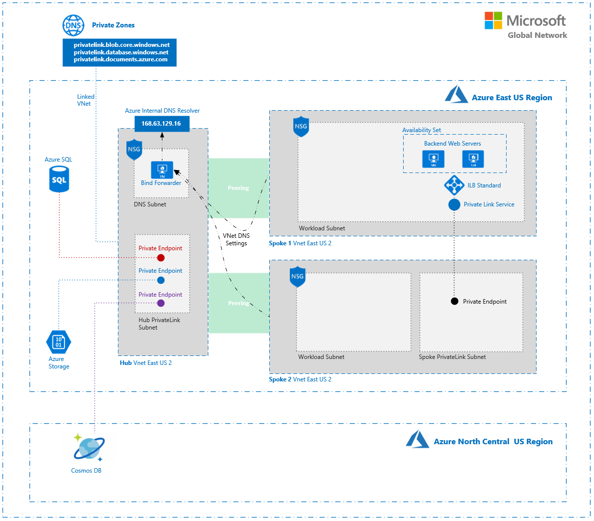
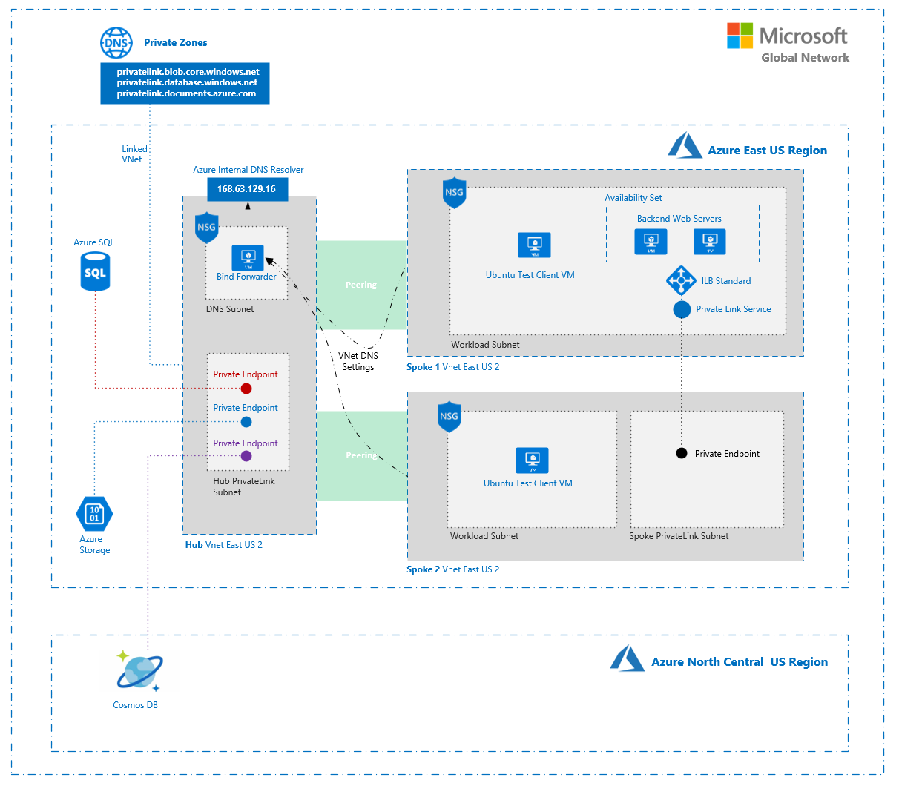

# Private Link Demo Environment

The scripts in this repository will build out an environment in which you can explore [Azure's Private Link Service](https://docs.microsoft.com/en-us/azure/private-link/) in the context of a [hub and spoke network architecture](https://docs.microsoft.com/en-us/azure/architecture/reference-architectures/hybrid-networking/hub-spoke).

There are two options for deploying the environment:

**Option 1** - *recommended*:\
( Step through each deployment phase. )
* Rename [params.sh.example](params.sh.example) to params.sh
* Update values for variables in params.sh that start with "your-".
* Run each script in order starting with [01-DeployVnets.sh](01-DeployVnets.sh) and ending with [07-DeployTestClients.sh](07-DeployTestClients.sh).
* Explore resources deployed after each step.

**Option 2:**\
( In a hurry? Deploy everything in one shot. )
1. Rename [params.sh.example](params.sh.example) to params.sh
* Update values for variables in params.sh that start with "your-".
3. Deploy all resources in one shot by running [00-RunAll.sh](00-RunAll.sh)

The scripts are well commented. Make sure to read through them before running!

## Step by Step

### [01-DeployVnets.sh](01-DeployVnets.sh)

This script deploys three VNets; One hub and two spokes.\
\
Within the hub VNet two subnets are created; A subnet to host a Bind DNS forwarder and a subnet for hosting private endpoints.\
\
Within the first spoke VNet a single subnet is created to host workload resources.\
\
Within the second spoke VNet two subnets are created; one for workload resources and one for private endpoints.

### [02-SqlPrivateLink.sh](02-SqlPrivateLink.sh)

This script deploys an Azure SQL server and a single database with AdventureWorks test data.\
\
It then create a [private endpoint](https://docs.microsoft.com/en-us/azure/private-link/private-endpoint-overview) in the hub VNet that can be used to access the database privately.\
\
Lastly, a [private zone](https://docs.microsoft.com/en-us/azure/dns/private-dns-overview) is created so that the [private endpoint](https://docs.microsoft.com/en-us/azure/private-link/private-endpoint-overview) can be referenced on the private network via the Bind forwarder.

### [03-StoragePrivateLink.sh](03-StoragePrivateLink.sh)

This script is almost identical to the above noted script.\
Instead of deploying a SQL DB this script deploys a storage account with a [private endpoint](https://docs.microsoft.com/en-us/azure/private-link/private-endpoint-overview) in the hub along with a private zone.

### [04-CosmosPrivateLink](04-CosmosPrivateLink.sh)

This script is almost identical to the above noted script.\
Instead of deploying a storage account this script deploys a Cosmos account with a [private endpoint](https://docs.microsoft.com/en-us/azure/private-link/private-endpoint-overview) in the hub along with a private zone.

### [05-DeployForwarder.sh](05-DeployForwarder.sh)

This script deploys a Bind forwarder (Ubuntu) into the DNS subnet in the hub. 
\
Both spoke VNets are then configured to reference the Bind server for all lookups.\
\
In a typical scenario this forwarder would be configured to conditionally forward requests to on-premises resolvers and Azure. In this example we just forward all requests to [Azure's internal resolver address](https://docs.microsoft.com/en-us/azure/virtual-network/what-is-ip-address-168-63-129-16) (168.63.129.16).\
See [configforwarder.sh](configforwarder.sh) for details.

### [06-PrivateLinkService.sh](06-PrivateLinkService.sh)

This script deploys a custom [Private Link Service](https://docs.microsoft.com/en-us/azure/private-link/private-link-service-overview).\
The service is configured to reference a standard load balancer that balances traffic between two simple NGINX servers.\
\
A [private endpoint](https://docs.microsoft.com/en-us/azure/private-link/private-endpoint-overview) is then created in the second spoke referencing the above noted custom Private Link Service such that resources in the second spoke can access the service through the endpoint.

### [07-DeployTestClients.sh](07-DeployTestClients.sh)

This script deploys a Windows Server VM into each spoke's workload subnet. These VMs can be used to test the various Private Link Services and Endpoints that we've deployed.\
These are basic VMs. You'll have to deploy test tools like SSMS, etc. to conduct whatever tests you'd like to conduct.

## Some Ideas for Testing
1. Install [SSMS](https://docs.microsoft.com/en-us/sql/ssms/download-sql-server-management-studio-ssms?view=sql-server-ver15) and [Azure Storage Explorer](https://azure.microsoft.com/en-us/features/storage-explorer/) on the test client VM's in each spoke and connect to the SQL server through the service endpoint in the Hub.
2. Try connecting to the SQL server from the internet or another network through the public IP. This shouldn't work due to access restrictions configuration.
3. Try the same with the storage and Cosmos account using Azure Storage Explorer (You'll have to install this on the test clients)
4. Try connecting to the resources from the test clients with both with the original resource FQDNs and the custom private zone FQDNs. Both should work due to the CName chains in place.
5. Take a look at the DNS records for the storage account, SQL Server or Cosmos account using Dig. NSlookup the records ( both the original public record and the private zone records ) from the test clients.
6. Try connecting directly to the private front-end IP of the standard load balancer for the custom Private Link Service from both spokes. You should be able to access it only from Spoke 1 due to non-transitive routing.
7. Connect to the custom Private Link Service from Spoke 2 via the private endpoint in Spoke 2. This allows resources in Spoke 2 to reach the custom service without peering through the endpoint.
8. Explore the private link service resource. Take a look at the Nat and Access Security options.

## A bit more about DNS and Private Link
DNS resolution is an important aspect of setting up a private endpoint. In particular, when setting up private endpoints to Azure services (storage, SQL, Cosmos, etc.) you need to consider how the pre-existing resource URLs will interact with your private DNS.\
\
We'll use Azure SQL as an example here, but the same patterns are applicable to other services. When you deploy an Azure SQL DB, Azure creates a CName record in DNS on your behalf so that you can easily access the server. For example, if you create a database called "kensdb", a set of records will be created as follows:
```
kensdb.database.windows.net. 159 IN CNAME   dataslice4.eastus2.database.windows.net.

dataslice4.eastus2.database.windows.net. 137 IN CNAME

cr4.eastus2-a.control.database.windows.net.
cr4.eastus2-a.control.database.windows.net. 21002 IN A 52.167.104.0
```
If you look closely you'll see a chain of CNAME records that eventually resolve to an A record referencing the IP address of the server. From a clients perspective, this results in multiple DNS queries. The first CNAME refers the client to the second CNAME, the second CNAME refers the client to the A record (and the IP).\
\
When an Azure resource is referenced by a private endpoint, the DNS records for that resource are modified as a result. Azure inserts one additional CNAME into the chain. For example, see the second record ** in the below set:

```
kensdb.database.windows.net. 157 IN CNAME   kensdb.privatelink.database.windows.net.

** kensdb.privatelink.database.windows.net. 157 IN CNAME dataslice4.eastus2.database.windows.net.

dataslice4.eastus2.database.windows.net. 67 IN CNAME

cr4.eastus2-a.control.database.windows.net.
cr4.eastus2-a.control.database.windows.net. 20990 IN A 52.167.104.0
```

Under normal circumstances (e.g. if a query is made from the internet) this additional record doesn't impact the end result of the query. Eventually the chain of lookups results in the A record being returned.\
\
If however you have registered a private record matching the newly inserted CNAME **mysqldb.privatelink.database.windows.net.** and the query is coming from a resource that can resolve the private record, the private record will be returned and the chain will be broken. This is an example of what is commonly referred to as [split horizon DNS](https://en.wikipedia.org/wiki/Split-horizon_DNS). It allows you to have external DNS queries resolve differently than those that are issued from your private network.\
\
The net result in this case is that even when the original resource FQDN is used to look up the resource, the IP of your private endpoint will be returned when the lookup is made on your internal network. From an end-user's perspective this simplifies use of the private endpoint.\
\
You don't have control over what CNAME gets inserted into the chain when the resource is reference by the private endpoint. It is always constructed using a pre-determined naming pattern. For this reason, it's important to use the [recommended zone names](https://docs.microsoft.com/en-us/azure/private-link/private-endpoint-overview#dns-configuration) when setting up your private zones for your endpoints so that split horizon DNS works properly.
\
\
In addition to the above it's important to note that although it's possible to create multiple private endpoints pointing to the same resource ( for example one endpoint in each spoke pointing to the same SQL Server ), the way DNS is handled makes this difficult to recommend.\
\
The [documentation](https://docs.microsoft.com/en-us/azure/private-link/private-endpoint-overview#private-endpoint-properties) notes:\
*"Multiple private endpoints can be created using the same private link resource. For a single network using a common DNS server configuration, the recommended practice is to use a single private endpoint for a given private link resource to avoid duplicate entries or conflicts in DNS resolution."*

For this reason I've created a single endpoint in the hub for each service in this demo environment.

This doesn't necessarily apply for custom Private Link Services as with these you have complete control over DNS resolution.

## Built With

* [Azure CLI 2.0](https://docs.microsoft.com/en-us/cli/azure/install-azure-cli?view=azure-cli-latest) - Azure Command Line Interface
* [Visual Studio Code](https://code.visualstudio.com/) - The best code editor out there... Seriously.
* [Windows Subsystem for Linux](https://docs.microsoft.com/en-us/windows/wsl/install-win10) - Linux on Windows

## Contributing

Pull Requests Welcome

## Authors

**Ken Skvarcius**
